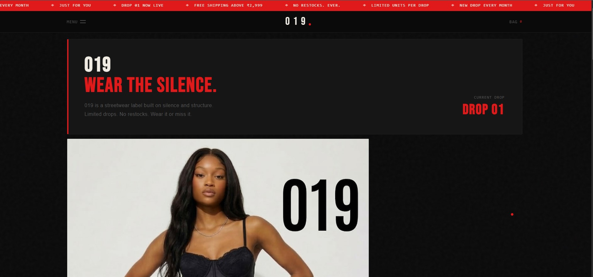
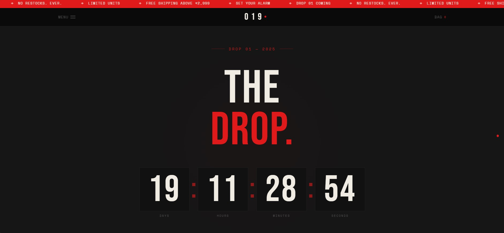
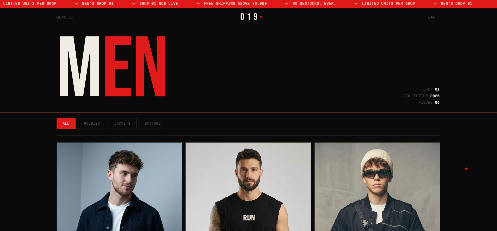
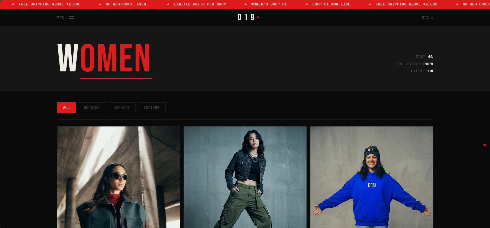
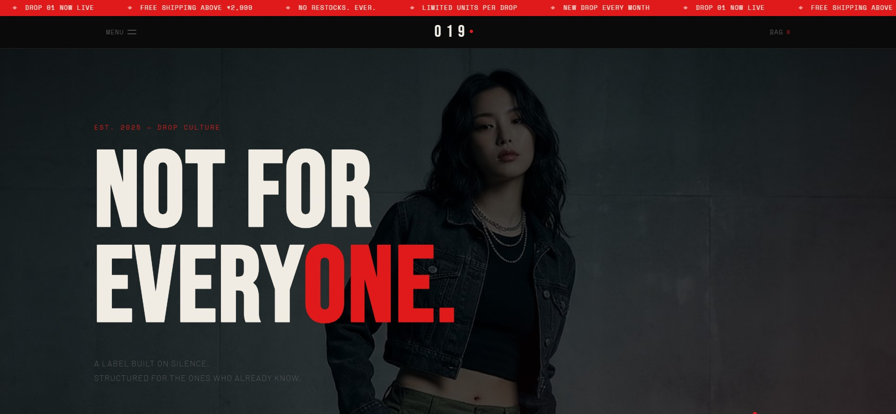

<div align="center">

### *Not for everyone. Made for you.*


**[Live Site →](https://019-brand.vercel.app/)**

</div>

---

## The Brand

**019** is a drop-culture streetwear brand concept. Limited releases. No restocks. High anticipation.

The name means nothing — and everything. 019 is a number with no history. We gave it one.

Designed for an audience that doesn't follow trends. They set silence.

---

## Pages

| Page | What it does |
|------|-------------|
| `index.html` | Home — hero card, product grid with category filter |
| `men.html` | Men's collection — minimal full-width title reveal, flip cards |
| `women.html` | Women's collection — editorial strip header, flip cards |
| `about.html` | Brand story, manifesto, numbers, editorial layout |
| `new-drops.html` | Live countdown — products locked until drop goes live |

---

## Screenshots

**Home**


**New Drops — Locked State**


**Men's Page**


**Women's Page**


**About Page**


---

## Features

```
LIVE DROP SYSTEM      →   Countdown timer. Products locked. Auto-unlock at drop time.
3D FLIP CARDS         →   CSS preserve-3d. Front shows image. Back plays video on hover.
CUSTOM CURSOR         →   Red dot. Expands to hollow ring on interactive elements.
LOGO FLIPPER          →   Digits animate in with elastic bounce on every page load.
SCROLL REVEAL         →   IntersectionObserver. Sections fade up as you enter them.
PRODUCT FILTER        →   Client-side. Hoodies / Jackets / Bottoms. Zero page reload.
MARQUEE TICKER        →   Red announcement strip. Infinite scroll animation.
```

---

## Tech Stack

**Zero frameworks. Zero libraries. Zero dependencies.**

| Layer | Technology |
|-------|-----------|
| Structure | HTML5 |
| Styling | CSS3 — Grid, Flexbox, Custom Properties, 3D Transforms, Keyframes |
| Logic | Vanilla JavaScript ES6+ |
| Fonts | Google Fonts — Bebas Neue, Space Mono, Barlow |
| Deployment | Vercel |
| Version Control | Git + GitHub |
| AI Tooling | Claude AI — iterative prompt engineering for UI development |

---

## Design System

### Color

019 runs on a **two-color palette**. One does all the emotional work. Everything else steps back.

| Token | Hex | Role |
|-------|-----|------|
| Background | `#0a0a0a` | Near-black — warmer than `#000`, feels like fabric not a screen |
| Surface | `#111111` | Card backgrounds |
| Border | `#1f1f1f` | Subtle separation |
| Text | `#f0ece4` | Off-white — warm tone, editorial print feel |
| Muted | `#555555` | Secondary labels |
| **Accent** | **`#e01a1a`** | **The only color that speaks** |

The red (`#e01a1a`) never fills backgrounds. Never decorates. It appears only where attention must go — active states, IDs, the one word in a headline that matters. This is **accent dominance**.

---

### Typography

Three fonts. Each has exactly one job.

| Font | Job | Personality |
|------|-----|-------------|
| `Bebas Neue` | Headings, logo, titles | Loud. Condensed. Commands space. |
| `Space Mono` | Labels, IDs, prices, nav | Precise. Clinical. Serial number energy. |
| `Barlow` | Body text | Clean. Readable. Steps aside. |

> Bebas shouts. Space Mono whispers precisely. Barlow just speaks.

---

### Motion Principles

Every animation has intent. Nothing moves for decoration.

```
Logo flipper      →  The brand reveals itself, digit by digit
Page load stagger →  Things arrive. They don't just appear.
Card flip         →  There's more beneath the surface
Countdown unlock  →  The drop is an event, not a product listing
Scroll reveal     →  Content earns attention as you reach it
```

---

## How the Drop System Works

```js
// ← Change this one line to set your drop time
const DROP_DATE = new Date('2025-06-01T12:00:00');
```

```
Before drop time  →  Countdown running. Cards visible but locked with overlay.
At drop time      →  Cards unlock one by one. Border flashes red. Live banner appears.
After drop time   →  Full shop unlocked. Prices revealed.
```

---

## Project Structure

```
019/
├── index.html          — Home
├── about.html          — Brand Story
├── men.html            — Men's Collection
├── women.html          — Women's Collection
├── new-drops.html      — Drop Countdown + Unlock
├── style.css           — Shared design system
├── script.js           — Shared logic
├── reve-images-1/      — Product & model images
├── videos/             — Product preview videos (.mp4)
└── screenshots/        — README screenshots
```

---

## Run Locally

No build step. No install. Just open.

```bash
git clone https://github.com/yourusername/019.git
cd 019
open index.html
```

---

<div align="center">

*019 — Drop culture. No restocks. No explanations.*

</div>
